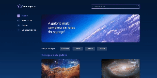
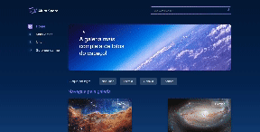

# Configurações Iniciais do Projeto Django-Templates

Neste projeto, abordei as configurações iniciais essenciais para um projeto em Django. Explorei a criação de aplicativos, o registro de rotas e a configuração de templates e arquivos estáticos.

Além disso, examinei a implementação do princípio DRY (Don't Repeat Yourself) nos arquivos HTML, utilizando partials para promover a reutilização de código. Destaquei também boas práticas específicas do Django para garantir uma organização eficiente e sustentável do projeto.

# Integrando o Projeto ao Banco de Dados
Durante o desenvolvimento deste projeto, aprimorei minhas habilidades ao integrar o Django com o banco de dados. 

Isso envolveu a criação de models e sua administração por meio do Django Admin. Além disso, explorei a implementação de novas funcionalidades, como a barra de pesquisa, e aprimorei as funcionalidades existentes dentro do Django Admin. Essa experiência proporcionou uma compreensão mais profunda da interação eficaz entre o framework e o banco de dados, contribuindo significativamente para o progresso do projeto.

